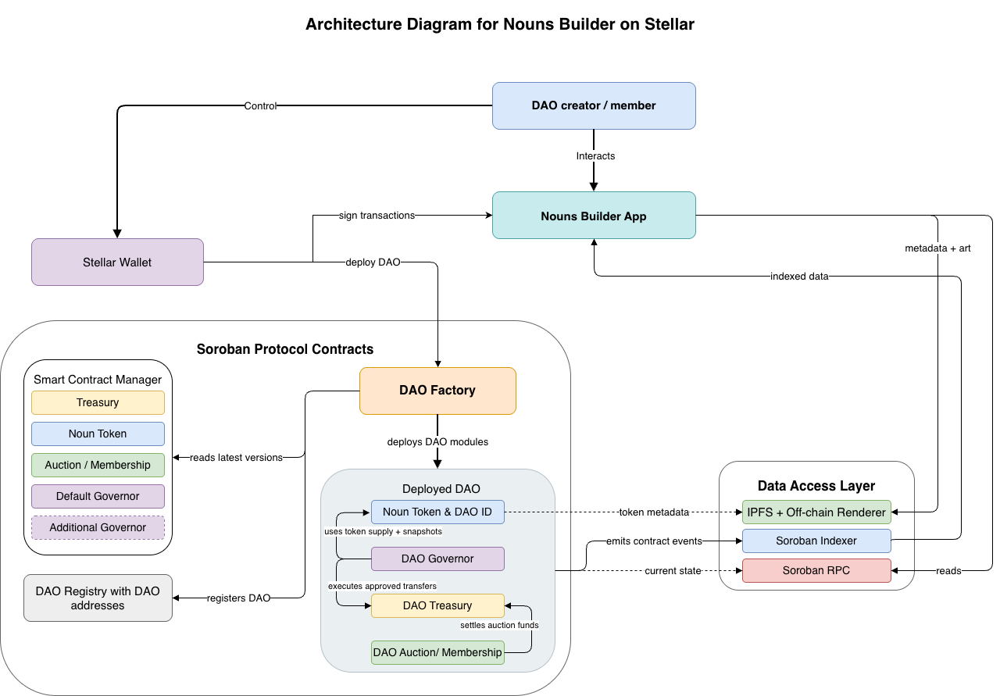

# Nouns Builder on Stellar Technical Plan

## 1) Overview

This document defines the build plan for a lean, Soroban-native Nouns Builder on Stellar. The implementation is a Rust/Soroban rewrite inspired by Nouns Builder architecture, not a Solidity contract fork.

Primary outcome:

- users can create and run a Nouns-style DAO on Stellar
- DAOs can issue NFT-style governance membership tokens aligned with SEP-0050 draft interfaces where practical
- DAOs can run recurring auctions with treasury settlement and token-weighted governance
- DAOs can upgrade modules through governance against Manager-published implementations

Design principles:

- choose one credible mainnet path over broad feature coverage
- keep security and authorization explicit and testable
- optimize for operational sustainability on Soroban storage and resource constraints
- defer non-critical product surfaces and integrations to post-MVP or later tranches

## 2) Scope and Non-Goals

In scope:

- Manager contract for module implementation registry and approved upgrade paths
- DAO factory and registry with deterministic deployment and canonical DAO identity
- Token contract with SEP-0050-aligned core NFT interface and DAO governance extensions
- Recurring auction module using one accepted bid asset per DAO (XLM via SAC by default)
- Treasury module with limited typed transfer actions in MVP
- Governor module with token-weighted voting and upgrade proposal support
- Metadata module with on-chain deterministic seeds and governance-configurable renderer URL
- minimal app surfaces for create DAO, auctions, proposals, voting, treasury summary, directory
- indexer integration using SubQuery for Stellar/Soroban read models
- Tranche 1 to Tranche 3 path through testnet hardening, audit, mainnet pilot DAOs

Out of scope for this budget:

- full EVM parity with existing Nouns Builder
- arbitrary treasury execution in MVP
- multiple advanced governor types in MVP
- production NQG dependency in MVP
- full MIDAO administration workflows
- bespoke non-SubQuery indexer infrastructure
- unified cross-event social activity feed
- fully on-chain art rendering
- broad analytics platform and bot integrations

MVP scope boundaries:

- one main auction path, one accepted asset per DAO at a time
- treasury supports only native and token transfer typed actions
- signature-based off-chain voting is deferred
- integrations are compatibility surfaces first, production dependencies later

## 3) Core Architecture Decisions

1. Soroban-native rewrite: all protocol contracts are new Rust/Soroban modules.
2. Modular system: Manager, Factory, Registry, Token, Auction, Treasury, Governor, Metadata are separate contracts.
3. DAO identity: token contract address is the canonical DAO ID.
4. Deployment flow: factory deploys token first, then sibling modules wired to DAO ID.
5. Upgrade model: no proxy pattern; each upgradable module uses Soroban WASM update mechanism via governance-approved flow.
6. Governance-controlled upgrades: Manager publishes approved module implementations and upgrade paths; each DAO opts in by proposal.
7. Token standard strategy: follow SEP-0050 trait surface where practical and isolate governance extensions from standard-facing methods.
8. Voting snapshots: use per-transfer checkpointing with historical query support and bounded pruning policy.
9. Auction launch policy: auctions start paused and are enabled by governance or optional one-shot launch admin.
10. Treasury safety: constrained typed actions in MVP; no general-purpose arbitrary execution.
11. Metadata strategy: deterministic on-chain seeds with off-chain rendering endpoint.
12. Indexing strategy: use SubQuery for indexing and read models, and reconcile critical state against direct contract reads.
13. SubQuery implementation reference: https://subquery.network/doc/indexer/quickstart/quickstart_chains/stellar.html
14. Mainnet gate: deployment contingent on security review, remediation, monitoring, and pilot readiness.

### Architecture and Flow Diagrams

#### DAO Creation and Launch

Live Mermaid URL: https://mermaid.ai/d/6b1c49e7-d48a-4f92-94e6-d80df3a4aaf6

#### DAO Proposal Execution Flow

Live Mermaid URL: https://mermaid.ai/d/9a71da6a-b66e-4853-8d9a-4b02e8d494a3

#### Builder Stellar Architecture

## 4) Module Responsibilities

### Manager

- stores current implementation hashes by module type
- registers approved upgrade paths and version metadata
- enforces timelocked publication model and rollback resistance controls
- emits upgrade availability events consumed by app/SubQuery indexers

MVP requirements:

- account-level multisig governance of Manager authority
- timelocked upgrade publication
- emergency pause for factory deployment path

### DaoFactory

- validates DAO creation inputs
- deploys modules from Manager-approved current implementations
- initializes modules and transfers ongoing operational authority to DAO structure
- emits canonical DAO creation events

### DaoRegistry

- maps DAO ID to module addresses and active configuration
- exposes authoritative directory data for app and SubQuery indexer reconciliation
- remains stable and minimal in write surface

### Token

- implements core NFT ownership, transfer, approval, metadata interface
- provides DAO-specific extensions for mint authority, voting power queries, and seed retrieval
- records vote checkpoints on supply and ownership changes
- enforces founder allocation limits at DAO creation configuration

MVP requirements:

- strict minter authorization registry
- deterministic token URI composition from configured renderer + stored seed
- historical vote lookup for governance snapshots

### Auction

- mints and[118;1:3u auctions recurring governance tokens
- accepts one configured bid asset per DAO (default XLM via SAC)
- supports reserve price, duration, extension, minimum increment
- handles outbid refunds with push-first and pull-claim fallback
- settles proceeds to treasury and executes protocol reward distributions

MVP requirements:

- paused-by-default launch
- governance-configurable accepted asset
- bounded execution behavior for refund and settlement safety

### Treasury

- custodial module for DAO-owned assets
- executes proposal-authorized typed actions
- records execution events for auditability and SubQuery indexing

MVP action surface:

- transfer native asset
- transfer token asset

Deferred:

- arbitrary cross-contract call actions
- broad action registry expansion beyond minimal transfer surface

### Governor

- proposal creation, voting, quorum/success checks, execution queueing
- snapshot-based vote accounting via token historical vote queries
- replay protection and one-time execution safeguards
- module upgrade proposal flow for DAO-local opt-in upgrades

MVP requirements:

- token-weighted voting
- direct on-chain authorization for vote casting
- vetoer safety role with one-way burn capability

### Metadata

- stores renderer base URL and metadata configuration values
- stores deterministic seed-generation parameters used by token metadata flow
- emits metadata config update events

## 5) Security and Authorization Model

Security posture centers on explicit Soroban authorization boundaries and limited privilege surfaces.

Authorization architecture:

- privileged functions explicitly require authorized addresses
- Governor triggers approved actions; Treasury is execution boundary for controlled asset movement
- managed modules trust configured owner authority and do not accept implicit caller propagation assumptions
- Factory authority is temporary during initialization and removed after handoff

Manager trust controls:

- managed by hardened multisig account policy
- timelocked implementation publication
- explicit upgrade path validation to reduce downgrade or rollback risk
- emergency pause for deployment path if critical issue is identified

Core invariants:

- DAO creation integrity: only valid factory/registry path creates canonical DAOs
- token ownership integrity: each token has single valid owner or burned state
- vote snapshot integrity: past vote queries are stable for governance ledgers
- auction escrow integrity: funds are settled, refunded, or claimable; no stuck intermediate state
- treasury authorization integrity: asset movement requires successful governance execution path
- proposal replay safety: executed proposals cannot execute again
- module upgrade isolation: DAO can only upgrade its own modules through its own governance
- storage liveness: required persistent records have explicit maintenance strategy

## 6) Storage and Voting Checkpoint Strategy

Storage policy:

- persistent storage for long-lived DAO-critical state
- instance storage for compact contract-level configuration
- temporary storage only for short-lived anti-abuse or lock patterns

MVP assignment priorities:

- persistent: ownership, balances, proposals, vote records, auction state, treasury records, registry mappings, token seeds
- instance: module config, authority addresses, key runtime settings
- temporary: short-lived bid/process locks where relevant

Voting checkpoint decision:

- Option A is selected for MVP: per-transfer checkpointing with historical lookup
- checkpoint writes occur on mint, burn, transfer, and governance-relevant supply/ownership changes
- pruning policy applies bounded retention and per-address cap to contain growth
- permissionless maintenance entry point exists for pruning and dormant state hygiene

Operational storage policy:

- built-in TTL bumping during normal protocol operations
- permissionless maintenance path for dormant DAOs
- documented restore and maintenance runbook required before mainnet launch
- treasury budget for annual storage maintenance included in DAO operations planning

## 7) Delivery Tranches and Milestones

### Tranche 1: MVP (Testnet Core Path)

Goal: prove end-to-end DAO creation, auction, governance, treasury transfer, and module upgrade flow on testnet.

Deliverables:

- core contracts for Manager, Factory, Registry, Token, Auction, Treasury, Governor, Metadata
- deployment scripts and contract test suite
- minimal app surfaces for creation, auctions, proposals, voting, treasury summary, directory
- integrated SubQuery-backed read path with reconciliation for critical current state
- storage maintenance hooks and operational baseline procedures

Exit test:

- user creates DAO via app
- DAO runs auction cycle and settles proceeds to treasury
- governance approves and executes treasury transfer
- governance upgrades at least one module against Manager-published implementation

### Tranche 2: Testnet Hardening and Integration Readiness

Goal: improve configurability and compatibility without expanding to full feature parity.

Deliverables:

- hardening of contract and app flows based on MVP feedback
- one additional non-auction launch mode
- governance compatibility adapter interface and mock integration path
- legal-wrapper export workflow support for partner operations
- pilot onboarding for testnet DAOs

Exit test:

- users can create DAOs with auction launch or capped membership launch
- compatibility adapter and mock path are exercised
- pilot DAOs run active governance and treasury operations on testnet

### Tranche 3: Mainnet Readiness and Pilot Launch

Goal: deploy audited system to mainnet and launch initial production cohort.

Deliverables:

- security review and remediation package
- mainnet deployment and verification procedures
- production app/SubQuery indexer reliability hardening
- operational monitoring and emergency procedures
- 2-3 mainnet pilot DAO launches

Exit test:

- audited contracts deployed to mainnet
- critical/high findings resolved or formally accepted with documented controls
- pilot DAOs operating live with auctions, voting, and treasury movement

## 8) Risk Register

| Risk | Impact | Mitigation |
| --- | --- | --- |
| Authorization model mistakes across contracts | Unauthorized access or blocked operations | Explicit auth boundaries, authorization matrix tests, negative-path testing |
| Manager compromise | Ecosystem-wide malicious implementation publication risk | Multisig authority, timelock, emergency pause, signer diversity |
| Storage TTL maintenance failures | Archived state, degraded DAO operations | Built-in bumps, permissionless maintenance, monitoring and runbooks |
| Resource limit exhaustion | Failed complex operations | Bounded action surfaces, proposal complexity checks, pagination patterns |
| Upgrade migration errors | State incompatibility after WASM update | Versioned migration policy, staged testnet rehearsal, rollback procedures |
| SEP-0050 draft evolution | Interface drift and compatibility breakage | Isolation of standard-facing methods from governance core logic |
| SubQuery indexer lag or outage | Delayed UX visibility | Fallback reconciliation with direct contract state reads |
| Wallet ecosystem maturity | User flow friction | Multi-wallet integration baseline and simplified MVP flows |
| Integration partner timing (NQG/MIDAO) | Delayed external dependencies | Commit only to compatibility/mocks in scoped tranches |
| Pilot DAO sourcing delays | Tranche completion risk | Begin sourcing in Tranche 1 with explicit onboarding ownership |

## 9) Acceptance Criteria

Core protocol behavior:

1. User can create a DAO from the app without direct contract tooling.
2. DAO ID equals deployed token contract address and is registered canonically.
3. Token ownership, approvals, and transfer behavior are correct and indexable.
4. Auction lifecycle supports bid, anti-snipe extension, outbid refund handling, settlement, and treasury deposit.
5. Governance voting and execution can successfully perform at least one treasury transfer action.
6. Governance can execute a module upgrade against a Manager-approved implementation path.
7. Metadata seed and renderer URL flow produces deterministic token metadata URLs.

Security and authorization:

8. Unauthorized callers fail on privileged methods across all modules.
9. Factory authority cannot be used after DAO initialization handoff.
10. Governor and Treasury authorization chain enforces one-way execution boundaries.
11. Proposal replay protection prevents duplicate execution.
12. Minter authorization restricts mint calls to approved minters only.
13. Manager publication controls enforce multisig and timelock policy.

Storage and resource compliance:

14. Checkpointed past vote queries return correct values at proposal snapshot ledgers.
15. Checkpoint pruning and retention cap policies function as specified.
16. Dormant DAO maintenance path can refresh required storage state.
17. High-frequency governance and auction paths execute within Soroban resource limits for target MVP scale.

Upgrade and migration safety:

18. Non-breaking module upgrades execute without data loss.
19. Breaking-change migration path is tested and idempotent.
20. Upgrade rollback or recovery procedure is documented and rehearsed on testnet.

Deployment and operations:

21. Mainnet deployment artifacts, monitoring setup, and emergency procedures are complete.
22. App and SubQuery indexer stack support DAO creation, governance views, and treasury state visibility.
23. Storage maintenance budget policy is defined and tracked per DAO.
24. At least 2-3 pilot DAOs are launched and active on mainnet.
